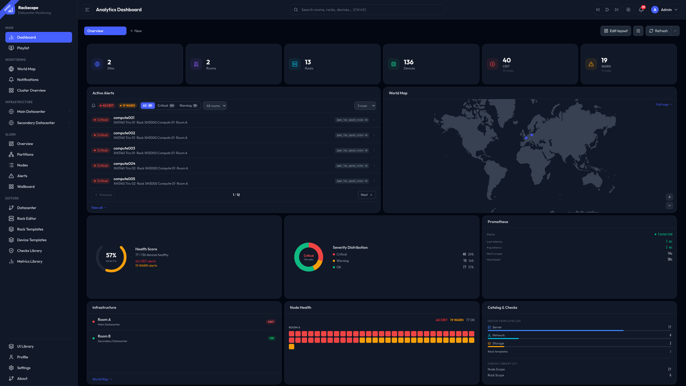

<div align="center">

# 🔭 Rackscope

**Physical infrastructure visibility for data centers and HPC clusters**

[](https://github.com/SckyzO/rackscope/actions/workflows/ci.yml)
[](CHANGELOG.md)
[](STATUS.md)
[](STATUS.md)
[](pyproject.toml)
[](frontend/package.json)
[](LICENSE)

[🌐 rackscope.dev](https://rackscope.dev) · [📚 Documentation](https://rackscope.dev) · [🐛 Issues](https://github.com/SckyzO/rackscope/issues) · [🚀 Quick Start](#-quick-start)

</div>

---

## What is Rackscope?

Rackscope is a **physical visualization layer** for teams operating data centers and HPC clusters.

When an alert fires, monitoring tools typically tell you *what* is wrong — but rarely *where* in the physical infrastructure the problem is located. Rackscope provides that physical context, bridging metrics and alerts to the actual topology of your infrastructure.

### Infrastructure navigation by level

Rackscope follows an inverted-pyramid approach. You start from a global view of the entire infrastructure — overall health, active alerts, visibility across all sites — then progressively drill down into finer levels of detail:

```
Global        All sites — health summary, world map, active alerts
  └── Datacenter    Site-level overview — rooms, rack count, status
        └── Room    Floor plan — aisle layout, rack grid, display styles
              └── Aisle    Row of racks — aggregate severity per aisle
                    └── Rack    Front/rear elevation — device placement
                          └── Device    Chassis or unit — instances, checks
                                └── Instance    Single node — live health state
```

At each level, only the relevant information is displayed. This approach makes it possible to move very quickly from a global view to the precise identification of a problem — for example: a cluster in critical state → a specific rack → a precise server in a given room.

### Native integration with Prometheus

Rackscope relies entirely on Prometheus for metrics collection. Any metric exposed in Prometheus can become a visible check in the interface, whether it comes from:

- **Hardware** — IPMI, PDU, racks, sensors
- **Software** — services, applications, custom exporters
- **Network or storage infrastructure**
- **HPC environments** — Slurm, job schedulers

In practice: if a metric is collected by Prometheus, Rackscope can display it in its physical context.

### A complementary tool, not a replacement

Rackscope does not seek to replace existing tools such as Grafana, Nagios, Icinga, or Zabbix. It positions itself as an **intermediate layer** between:

```
Grafana / dashboards        Rackscope              Supervision (Nagios/Zabbix)
────────────────────   →    ─────────────    →     ─────────────────────────────
Show the metrics            Physical context        Manage alerts and incidents
"cpu_usage is 95%"          "Rack C04, Aisle 2,     "Ticket #4821 opened"
                             Machine Room A"
```

Rackscope adds the one element that was missing: the **physical location** of the problem within the infrastructure.

### Simple, declarative configuration

The infrastructure described by Rackscope relies solely on YAML files. This approach enables configuration that is simple, human-readable, easily versioned, and fully compatible with a GitOps workflow.

The tool is **CMDB-agnostic** and can be populated in several ways:

```bash
# Automatic generation via scripts
python generate_topology.py --from-netbox > config/topology/sites.yaml

# Export from a CMDB (NetBox, RacksDB, etc.)
# Or use the API directly
curl -X POST /api/topology/sites -d '{"id":"dc-paris","name":"Paris DC"}'
```

No database required. No vendor lock-in. If your tools can write a file, Rackscope can read it.

### Extensible architecture

Rackscope includes a native plugin system for extending its capabilities. A plugin already provides Slurm integration, enabling visualization of node and partition states from the associated metrics. The architecture remains open to support additional plugins as needed.

| Hardware teams | Software teams |
|---|---|
| Server / rack down (`ipmi_up`, `node_up`) | Service availability (`up{job="myapp"}`) |
| Temperature & cooling (`ipmi_temperature`) | Critical app alerts (any custom metric) |
| PDU load & power (`pdu_total_load_watts`) | Slurm node states (`slurm_node_status`) |
| InfiniBand / network (`ib_port_state`) | Job queue depth, partition health |
| Storage health (`eseries_drive_status`) | Any Prometheus exporter |

---

## 📸 Overview



*Analytics dashboard — live health states, active alerts, world map, Prometheus stats*

---

## ✨ Key Features

### 🗺️ Physical Views
- **World Map** — sites across the globe with live health markers
- **Datacenter View** — site overview with room cards and mini rack grids
- **Room View** — floor plan with rack grid, zoom controls, 10 display styles
- **Rack View** — front/rear elevation with template-driven device placement
- **Device View** — instance-level drill-down with live metrics and check results
- **Cluster Overview** — wallboard for small clusters, drag-and-drop rack ordering

### 📊 Dashboard
- Drag-and-drop widget grid with 20+ widgets
- Deep-linkable dashboard URLs (`/dashboard/:id`)
- Per-user layout, dark/light mode, NOC-ready

### 🏥 Health Checks
- PromQL-based checks with severity rules (OK / Warning / Critical)
- `for:` debounce — alert only if condition persists N minutes
- `expand_by_label` — per-sub-component checks (per disk slot, per port…)
- Health propagates: node → chassis → rack → room → site

### 🖥️ HPC / Slurm
- Node state monitoring with configurable status mapping
- Wallboard, partitions, alerts, and nodes list views
- Node mapping with wildcard patterns
- Native Slurm metrics plugin

### 🔔 NOC Features
- **Sound alerts** — 6 configurable presets including fire truck siren, mute toggle
- **Playlist mode** — automatic view rotation for NOC screens
- **Notification panel** — adaptive height, mute toggle, real-time badge

### ⚙️ Configuration & Editors
- All config in YAML — GitOps-friendly, no database required
- Visual editors: topology, rack, templates, checks, metrics, settings
- Bundled examples: `simple-room` (10 nodes) and `full-datacenter` (855 nodes HPC cluster)

---

## 🚀 Quick Start

**Requirements**: Docker & Docker Compose. Nothing else.

```bash
git clone https://github.com/SckyzO/rackscope.git
cd rackscope
make up
```

| Service | URL | Description |
|---|---|---|
| 🖥️ **Web UI** | http://localhost:5173 | Main interface |
| 📖 **API Docs** | http://localhost:8000/docs | Swagger / OpenAPI |
| 📊 **Prometheus** | http://localhost:9090 | Metrics backend |
| 🔬 **Simulator** | http://localhost:9000 | Demo metrics |
| 📚 **Docs** | http://localhost:3001 | Documentation site |

The stack starts with the `full-datacenter` example (855 simulated nodes) — explore immediately, no hardware required.

Try the bundled examples:

```bash
./scripts/use-example.sh simple-room       # 1 room, 4 racks, ~10 nodes
./scripts/use-example.sh full-datacenter   # 2 sites, 855-node HPC cluster
```

---

## 📁 Project Structure

```
rackscope/
├── config/                  # All configuration (YAML, GitOps-friendly)
│   ├── app.yaml             # Central config: Prometheus URL, features, plugins
│   ├── app.yaml.reference   # Fully annotated reference — copy to start fresh
│   ├── topology/            # Infrastructure: sites, rooms, racks, devices
│   ├── templates/           # Hardware templates (devices, racks, components)
│   ├── checks/library/      # Health check definitions (PromQL + rules)
│   ├── metrics/library/     # Metric definitions (display config, thresholds)
│   └── plugins/             # Per-plugin config (slurm, simulator)
├── examples/                # Ready-to-use example configurations
│   ├── simple-room/         # Minimal lab — 4 racks, ~10 nodes
│   └── full-datacenter/     # HPC cluster — 855 nodes, 2 sites, 22 racks
├── src/rackscope/           # Backend (FastAPI / Python 3.12)
├── frontend/src/            # Frontend (React 19 / TypeScript / Tailwind v4)
├── plugins/                 # Plugin system (simulator, slurm)
├── website/                 # Documentation site (Docusaurus 3)
├── scripts/                 # Utilities (use-example.sh, gen_status.py)
└── tests/                   # Backend test suite (852+ tests, 89% coverage)
```

---

## 🔌 Plugin System

Rackscope ships with two built-in plugins and a documented API to build your own:

| Plugin | Description | Status |
|---|---|---|
| **Simulator** | Realistic metric generation for demos and testing | Built-in |
| **Slurm** | HPC workload manager integration | Built-in |
| *Custom* | Build your own plugin with routes + menu sections | [See docs](https://rackscope.dev/plugins/writing-plugins) |

---

## 🛠️ Development

All commands run **inside Docker containers** — no local Python or Node.js needed.

```bash
# Stack
make up           # Start (backend · frontend · simulator · prometheus)
make down         # Stop
make restart      # Restart (picks up config changes)
make logs         # Follow all logs

# Quality
make lint         # ruff + eslint + stylelint + prettier
make test         # pytest (852+ tests)
make typecheck    # mypy — 0 errors
make coverage     # Coverage report → htmlcov/
make complexity   # radon cyclomatic complexity
make quality      # lint + typecheck + complexity + coverage

# Security
make security     # bandit + npm audit + pip-audit
make ci           # Full pipeline: quality + security

# Docs
make docs         # Docusaurus → http://localhost:3001
```

---

## 📚 Documentation

Full documentation at **[rackscope.dev](https://rackscope.dev)** (or `make docs` locally):

- [Getting Started](https://rackscope.dev/getting-started/quick-start)
- [Example Configurations](https://rackscope.dev/getting-started/examples)
- [Configuration Reference](https://rackscope.dev/admin-guide/app-yaml)
- [Topology YAML](https://rackscope.dev/admin-guide/topology-yaml)
- [Health Checks](https://rackscope.dev/user-guide/health-checks)
- [Plugin Development](https://rackscope.dev/plugins/writing-plugins)

---

## 🤝 Contributing

Contributions are welcome — please read [CONTRIBUTING.md](CONTRIBUTING.md) first.

Bug reports and feature requests → [GitHub Issues](https://github.com/SckyzO/rackscope/issues)

---

## ☕ Support

Rackscope is free and open-source. If it saves you time or brings value to your team, consider supporting its development:

<div align="center">

[](https://ko-fi.com/sckyzo)
[](https://www.paypal.me/sckyzo)

</div>

---

## 📄 License

[AGPL-3.0-or-later](LICENSE) — Thomas Bourcey ([@SckyzO](https://github.com/SckyzO))

For commercial use or proprietary deployments, contact **sckyzo@gmail.com**.

---

<div align="center">

Made with ❤️ for datacenter operators and HPC teams

</div>
