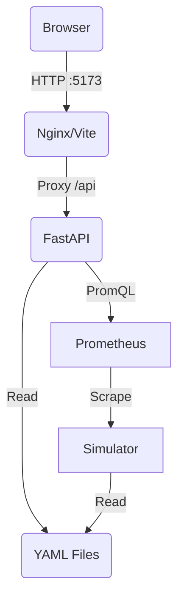

# Rackscope Architecture

## Overview

Rackscope is a **Physical Infrastructure Monitoring** dashboard designed for High Performance Computing (HPC) and Data Centers. It bridges the gap between physical layout (Racks, PDUs, Chassis) and logical telemetry (Prometheus).

## Core Principles

1.  **File-Based Source of Truth**: The physical topology (Sites, Rooms, Aisles, Racks) is defined in YAML files, enabling GitOps workflows.
2.  **Prometheus-First**: No internal time-series database. All metrics are queried live from Prometheus via PromQL.
3.  **HPC-Ready**: Native support for high-density chassis (Twins, Quads, Blades), liquid cooling (HMC), and shared infrastructure.

## System Components

### 1. Backend (Python / FastAPI)
- **Role**: API Gateway, Topology Loader, Telemetry Aggregator.
- **Key Modules**:
    - `model/`: Pydantic models for the domain (Rack, Device, Template, Metrics).
    - `loader.py`: Recursively loads YAML configuration from `config/`.
    - `telemetry/`: PromQL planner, async Prometheus client (`httpx`), cache/dedup.
    - `api/`: REST endpoints served by Uvicorn.
    - `plugins/`: Plugin system for optional features (Slurm, Simulator).

### 2. Frontend (React / Vite)
- **Role**: Single Page Application (SPA) for visualization.
- **Stack**: React 18, TypeScript, Tailwind CSS v4.
- **Key Components**:
- `RackVisualizer`: Rendering racks (Front/Rear) and chassis grids.
- `Sidebar`: Explorer-like navigation (Datacenter > Room > Aisle > Rack).
- `ThemeContext`: Handles Dark/Light mode and accent colors.
- **Slurm Wallboard**: Compact rack view based on `slurm_node_status` for
  HPC clusters (compute/visu filtering, status mapping).

### 3. Simulation Stack
- **Simulator**: Python service generating Prometheus metrics for demo/testing (config-driven).
- **Prometheus**: Standard instance scraping the simulator to provide a realistic query API for the backend.

## Slurm Wallboard

The Slurm Wallboard is a dedicated view that maps Slurm node states to the
physical rack layout without altering the existing topology model.

- **Metric**: `slurm_node_status` with labels `node`, `status`, `partition`.
- **Backend query**: `max by (node,status,partition)(slurm_node_status)`.
- **Mapping**: `slurm.status_map` defines which statuses are OK/WARN/CRIT.
- **Filtering**: device templates can define a `role` (compute/visu/etc) and
  the Slurm view only shows allowed roles.
- **Optional mapping file**: `slurm.mapping_path` can map Slurm node names to
  topology instances when naming differs.

## Slurm Dashboards

- **Cluster Overview**: aggregate status + severity distribution.
- **Partitions**: per-partition status breakdowns.
- **Node List**: nodes with topology context (site/room/rack/device).
- **Alerts**: list of WARN/CRIT nodes for quick triage.

## Plugin Architecture

Rackscope uses a plugin architecture to separate **core features** (always active) from **optional features** (plugins).

### Core vs Plugins

**Core** (always active):
- Physical topology visualization
- Prometheus telemetry integration
- Health checks and alerting
- Configuration editors

**Plugins** (optional):
- **SimulatorPlugin**: Demo mode with metrics generation
- **SlurmPlugin**: Workload manager integration
- Future: IPMI direct access, Redfish, custom dashboards

### Plugin Lifecycle

```
1. Registration  → Plugin registered with PluginRegistry
2. Initialization → Routes registered, on_startup() called
3. Runtime       → Serve endpoints, contribute menu sections
4. Shutdown      → on_shutdown() called for cleanup
```

### Plugin Components

Each plugin can:
- **Register API routes** via `register_routes(app)`
- **Contribute menu sections** via `register_menu_sections()`
- **React to lifecycle events** via `on_startup()` / `on_shutdown()`

**Example**:
```python
class SlurmPlugin(RackscopePlugin):
    @property
    def plugin_id(self) -> str:
        return "workload-slurm"

    def register_routes(self, app: FastAPI) -> None:
        app.include_router(slurm_router)

    def register_menu_sections(self) -> List[MenuSection]:
        return [
            MenuSection(
                id="workload",
                label="Workload",
                icon="Zap",
                order=50,
                items=[MenuItem(id="overview", label="Overview", path="/slurm/overview")]
            )
        ]
```

See [PLUGINS.md](PLUGINS.md) for plugin development guide.

## Metrics Library System

The Metrics Library defines how metrics are collected, displayed, and visualized.

### Metrics vs Checks

| Aspect | Checks | Metrics |
|--------|--------|---------|
| Purpose | Health monitoring (OK/WARN/CRIT) | Data visualization (charts, trends) |
| Location | `config/checks/library/` | `config/metrics/library/` |
| Output | Boolean or numeric → severity | Time series data |
| Display | Status badges, alerts | Charts, gauges, graphs |

### Metric Definition

Each metric is defined in a YAML file:

```yaml
# config/metrics/library/node_cpu_usage.yaml
id: node_cpu_usage
name: Node CPU Usage
description: CPU usage percentage (100 - idle time)
metric: 100 - (avg by(instance) (rate(node_cpu_seconds_total{mode="idle",instance="{instance}"}[5m])) * 100)
labels:
  instance: "{instance}"
display:
  unit: "%"
  chart_type: area
  color: "#3b82f6"
  time_ranges: [1h, 6h, 24h, 7d]
  default_range: 6h
  aggregation: avg
  thresholds:
    warn: 80
    crit: 95
category: performance
tags: [compute, cpu, node_exporter]
```

### Template Integration

Templates reference metrics by ID:

```yaml
# config/templates/devices/server/my-server.yaml
templates:
  - id: my-server
    metrics:
      - node_cpu_usage
      - node_power_watts
      - node_temperature_celsius
```

### Template-Driven Collection

The backend uses **generic metrics collection** based on templates:

```python
# No hardcoded queries! All driven by metric definitions
async def collect_device_metrics(device, template, metrics_library):
    for metric_id in template.metrics:
        metric_def = metrics_library.get_metric(metric_id)
        query = build_query(metric_def, device.instances)
        data = await prometheus.query(query)
        # ... process and return
```

**Benefits**:
- No hardcoded Prometheus queries in code
- Easy to add new metrics (just create YAML file)
- Consistent display across UI
- Reusable metric definitions

See [METRICS.md](METRICS.md) for complete metrics documentation.

## Data Model

### Topology Hierarchy
`Site` -> `Room` -> `Aisle` -> `Rack` -> `Device` -> `Instance`

### Room Layout Metadata
Rooms can include optional layout metadata to improve spatial context in the UI:
- `layout.shape`: visual hint (e.g. rectangle, L-shape).
- `layout.size`: physical size in meters (width/height).
- `layout.orientation.north`: where north is on screen (top/right/bottom/left).
- `layout.grid`: optional background grid (cell size in px).
- `layout.door`: door marker (side + position + label).

### Templates (The "Catalog")
To avoid repetition, hardware definitions are separated from topology.
- **DeviceTemplate**: Defines dimensions (U), type (Server/Switch), and physical layout (Matrix).
    - Supports `layout` (Front) and `rear_layout` (Back), plus optional `rear_components` for PSUs/Fans/IO.
- **RackTemplate**: Defines rack dimensions and built-in infrastructure (PDU, HMC, RMC).
    - Uses `rear_components` and `side_components` for back/zero‑U elements.

### Layout System
Rackscope uses a **Grid System** to render devices.
- A 2U chassis with 4 nodes is defined as a `2x2` matrix.
- A 4U storage drawer is defined as a `5x12` matrix.
- The UI automatically adapts density (switching to summary view) for high-density grids.

## Docker Architecture



## Configuration Editors
- **Template Editor**: create/update device/rack templates with live preview.
- **Topology Editor**: reorder racks between aisles, create datacenters/rooms/aisles.
- **Rack Editor**: place/remove devices in rack slots with collision checks.
