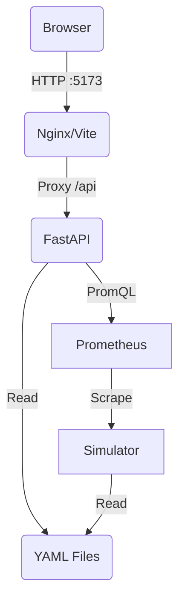

# Rackscope Architecture

## Overview

Rackscope is a **Physical Infrastructure Monitoring** dashboard designed for High Performance Computing (HPC) and Data Centers. It bridges the gap between physical layout (Racks, PDUs, Chassis) and logical telemetry (Prometheus).

## Core Principles

1.  **File-Based Source of Truth**: The physical topology (Sites, Rooms, Racks) is defined in YAML files, enabling GitOps workflows.
2.  **Prometheus-First**: No internal time-series database. All metrics are queried live from Prometheus via PromQL.
3.  **HPC-Ready**: Native support for high-density chassis (Twins, Quads, Blades), liquid cooling (HMC), and shared infrastructure.

## System Components

### 1. Backend (Python / FastAPI)
- **Role**: API Gateway, Topology Loader, Telemetry Aggregator.
- **Key Modules**:
    - `model/`: Pydantic models for the domain (Rack, Device, Template).
    - `loader.py`: Recursively loads YAML configuration from `config/`.
    - `telemetry/`: Async Prometheus client using `httpx`.
    - `api/`: REST endpoints served by Uvicorn.

### 2. Frontend (React / Vite)
- **Role**: Single Page Application (SPA) for visualization.
- **Stack**: React 18, TypeScript, Tailwind CSS v4.
- **Key Components**:
    - `RackVisualizer`: Universal component for rendering racks (Front/Rear) and chassis grids.
    - `Sidebar`: Hierarchical navigation (Site > Room > Aisle > Rack).
    - `ThemeContext`: Handles Dark/Light mode and accent colors.

### 3. Simulation Stack
- **Simulator**: Python script generating "fake" Prometheus metrics for defined nodes.
- **Prometheus**: Standard instance scraping the simulator to provide a realistic query API for the backend.

## Data Model

### Topology Hierarchy
`Site` -> `Room` -> `Aisle` -> `Rack` -> `Device` -> `Node`

### Templates (The "Catalog")
To avoid repetition, hardware definitions are separated from topology.
- **DeviceTemplate**: Defines dimensions (U), type (Server/Switch), and physical layout (Matrix).
    - Supports `layout` (Front) and `rear_layout` (Back), plus optional `rear_components` for PSUs/Fans/IO.
- **RackTemplate**: Defines rack dimensions and built-in infrastructure (PDU, HMC, RMC).
    - Uses `rear_components` and `side_components` for back/zero‑U elements.

### Layout System
Rackscope uses a **Grid System** to render devices.
- A 2U chassis with 4 nodes is defined as a `2x2` matrix.
- A 4U storage drawer is defined as a `5x12` matrix.
- The UI automatically adapts density (switching to summary view) for high-density grids.

## Docker Architecture

