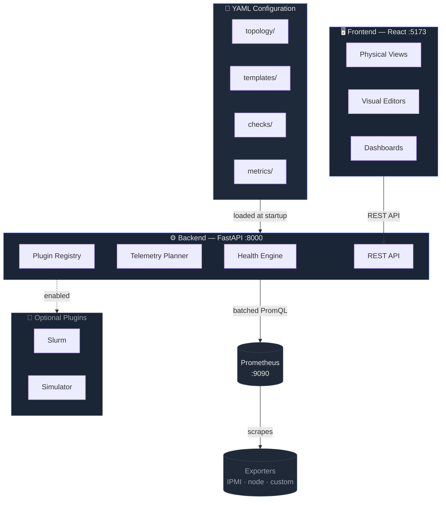

import StatusContent from './_status.md';

# Rackscope

**Prometheus-first physical infrastructure monitoring** for data centers and HPC environments.

## What is Rackscope?

Rackscope is a **physical visualization layer** for teams operating data centers and HPC clusters.

When an alert fires, monitoring tools typically indicate what is wrong — but rarely where the problem is located in the physical infrastructure. Rackscope provides that physical context, anchoring every metric and alert to the actual topology of the infrastructure.

### Native integration with Prometheus

Rackscope relies entirely on Prometheus for metrics collection. Any metric exposed in Prometheus can become a visible health check in the interface, regardless of its origin: hardware sensors, software services, network equipment, storage arrays, or HPC workloads.

### A complementary tool, not a replacement

Rackscope does not replace existing tools such as Grafana, Nagios, or Zabbix. It positions itself as an intermediate layer between metrics dashboards and supervision platforms — adding the physical location of the problem to the monitoring chain.

### Simple, declarative configuration

All infrastructure configuration is stored in YAML files — GitOps-compatible, version-controlled, and diff-friendly. The tool is CMDB-agnostic and can be fed by scripts, external CMDBs (NetBox, RacksDB), or the REST API directly.

---

## Key Features

| Feature | Description |
|---------|-------------|
| **Prometheus-First** | Live PromQL queries — no internal time-series database |
| **File-Based Topology** | YAML source of truth, GitOps-friendly, no database |
| **Template-Driven** | Define hardware once, reuse across racks |
| **Physical Views** | World map, room layout, front/rear rack views |
| **Visual Editors** | Topology, rack, template, checks, settings |
| **HPC Native** | Slurm integration, high-density chassis, liquid cooling |
| **Plugin Architecture** | Optional Slurm and Simulator plugins |
| **NOC-Ready** | Dark mode, playlist mode, sound alerts |

---

## Architecture

:::tip Deep dive
For the full architecture documentation — design principles, backend/frontend stacks, plugin system, and data model — see [Architecture Overview](/architecture/overview).
:::

---

## Status

<StatusContent />
